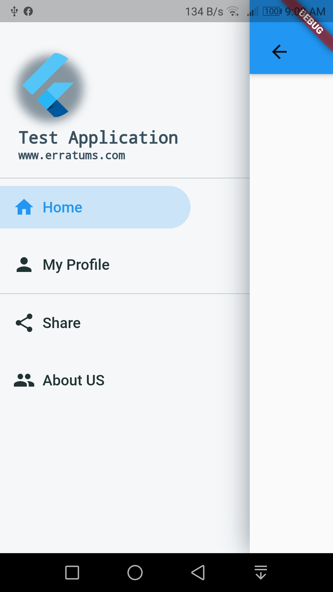

# Custom Navigation Drawer Controller

A Flutter package for drawer controller 

## Screenshots 

|   |   |   |
|---|---|---|
||&nbsp;&nbsp;&nbsp;&nbsp;&nbsp;||

<br/>    

## Getting Started

An example for flutter is provided [here](https://github.com/ajumalp/es_drawer_controller/blob/main/example/lib/main.dart)

As shown in the above screenshots, this control can create awesome navigation drawer very quickly. 
      
<br/>    

## How to create     

- **Create an enumaration and add all the name of menu your required as below**
  ```dart
  enum eDrawerIndex {
    diDivider, // This is to be used when ever you need a divider
    diHome,
    diProfile,
    diShare,
    diRateApp,
    diAboutUS,
  }
  ```
- **Next, you need to create a class from** `StatefulWidget` 
  ```dart
  class MainNavigation extends StatefulWidget {
    // This field is where you need to add your menu items { Ajmal }
    final List<ESDrawerItem<eDrawerIndex>> _cDrawerList = <ESDrawerItem<eDrawerIndex>>[
        const ESDrawerItem(type: eDrawerItemType.ditMenu, index: eDrawerIndex.diHome, labelName: 'Home', iconData: Icons.home),
        const ESDrawerItem(type: eDrawerItemType.ditMenu, index: eDrawerIndex.diProfile, labelName: 'My Profile', iconData: Icons.person),
        const ESDrawerItem(type: eDrawerItemType.ditDivider, index: eDrawerIndex.diDivider), // Add a divider here
        const ESDrawerItem(type: eDrawerItemType.ditLink, index: eDrawerIndex.diShare, labelName: 'Share', iconData: Icons.share),
        const ESDrawerItem(
        type: eDrawerItemType.ditLink,
        index: eDrawerIndex.diAboutUS,
        labelName: 'About US',
        iconData: Icons.group,
        // Please note: LaunchURL won't work. Can't open in package without activity { Ajmal }
        launchURL: '',
        ),
    ];

    @override
    _MainNavigationState createState() => _MainNavigationState();
  }
  ```
- In the above class, you will need to added a field `_cDrawerList` which is a list of Drawer Menu Items. Class has below properties, where `T` is the `enum` you created 1st. So 
  ```dart
  class ESDrawerItem<T> {
    final T index;
    final eDrawerItemType type;
    final String labelName;
    final IconData? iconData;
    final String? launchURL;
    final String imageName;

  ```
-  Now you need to add a state class for above. Something like `_MainNavigationState`. In this class you can return an instalnce of `ESDrawController`
   ```dart
   ESDrawerController<eDrawerIndex>(
      assetLogo: 'assets/images/ic_launcher.png',
      title: 'Test Application',
      subTitle: 'www.erratums.com',
      screenView: screenView,
      screenIndex: drawerIndex,
      drawerList: widget._cDrawerList,
      drawerWidth: MediaQuery.of(context).size.width * 0.75,
      // When user click on the menu, onDrawerCall is triggered
      onDrawerCall: (ESDrawerItem drawerItem) => _changeIndex(drawerItem),
    );
    ```
- Finally you should write a onDrawCall funtion to handle click events 
   ```dart
   void _changeIndex(ESDrawerItem drawerItem) {
       switch (drawerItem.index) {}
   }
   ```    